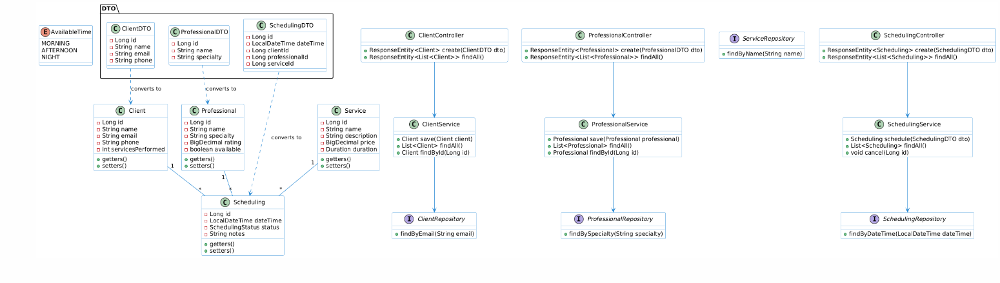

# Sistema de Agendamento

## 📋 Descrição

Sistema de agendamento desenvolvido em Spring Boot para gerenciamento de horários e serviços. O projeto permite o cadastro de clientes, profissionais e serviços, além do agendamento de horários.

## 🛠️ Tecnologias Utilizadas

- Java 17+
- Spring Boot
- Spring Data JPA
- PostgreSQL / H2 Database
- Maven

## 📦 Estrutura do Projeto

📦 Estrutura do Projeto

```bash
src/
└── main/
    ├── java/
    │   └── com/MatheusHolanda/agendamento/
    │       ├── config/
    │       ├── controller/
    │       ├── domain/
    │       │   ├── enums/
    │       │   ├── AvailableTime/
    │       │   ├── Client/
    │       │   ├── Professional/
    │       │   ├── Scheduling/
    │       │   └── Services/
    │       ├── DTO/
    │       ├── exception/
    │       ├── repository/
    │       ├── service/
    │       └── AgendamentoApplication.java
    └── resources/
        ├── static/
        ├── templates/
        ├── application.properties
        ├── application-h2.properties
        └── application-postgres.properties
```

## 🚀 Como Executar

### Pré-requisitos

- JDK 24
- Maven
- PostgreSQL (opcional - pode usar H2 para desenvolvimento)

### Configuração do Banco de Dados

1. PostgreSQL
    - Crie um banco de dados PostgreSQL
    - Configure as credenciais no arquivo `application-postgres.properties`:

   ```properties
   spring.datasource.url=jdbc:postgresql://localhost:5432/nome_do_banco
   spring.datasource.username=seu_usuario
   spring.datasource.password=sua_senha
   ```

2. H2 (banco em memória para desenvolvimento)

- Altere o perfil ativo no `application.properties`:

   ```properties
   spring.profiles.active=h2
   ```

### Executando a Aplicação

1. Clone o repositório

   ```bash
   git clone [url-do-repositório]
   ```

2. Entre na pasta do projeto

   ```bash
   cd agendamento
   ```

3. Execute o projeto com Maven

   ```bash
   mvn spring-boot:run
   ```

A aplicação estará disponível em `http://localhost:8080`

## Modelo Conceitual



## 📚 Funcionalidades

- Cadastro de clientes
- Cadastro de profissionais
- Gerenciamento de serviços
- Agendamento de horários
- Consulta de disponibilidade

## 🔍 Endpoints da API

- `GET /api/clients` - Lista todos os clientes
- `POST /api/clients` - Cadastra novo cliente
- `GET /api/professionals` - Lista todos os profissionais
- `POST /api/professionals` - Cadastra novo profissional
- `GET /api/services` - Lista todos os serviços
- `POST /api/scheduling` - Realiza um agendamento

## 👥 Contribuição

Contribuições são bem-vindas! Para contribuir:

1. Faça um fork do projeto
2. Crie uma branch para sua feature (`git checkout -b feature/AmazingFeature`)
3. Commit suas mudanças (`git commit -m 'Add some AmazingFeature'`)
4. Push para a branch (`git push origin feature/AmazingFeature`)
5. Abra um Pull Request

## 📝 Licença

Este projeto está sob a licença [MIT](https://opensource.org/licenses/MIT).

## ✒️ Autor

Matheus Holanda

---

## 📞 Suporte

#### 📧 Abra uma issue no repositório

#### 🌟 Dê uma estrela se gostou do projeto

#### 🔄 Contribua com um pull request
